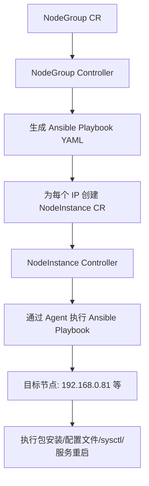

# NodeGroup Operator

NodeGroup Operator 是一个 Kubernetes 原生的节点配置管理工具，基于 Kubebuilder 构建，通过 **声明式 CR** 驱动 Ansible Playbook 执行，实现跨节点批量配置同步。

## 核心功能

- **软件包管理**：批量安装/升级指定版本的 deb 包（如 kubelet、containerd）
- **内核参数调优**：通过 sysctl 批量配置内核参数（如 tcp_keepalive_time、vm.max_map_count）
- **配置文件分发**：将配置文件（如 containerd config.toml、kubelet config.yaml）同步到目标节点
- **服务重启**：配置变更后自动重启相关服务（如 kubelet、containerd）
- **状态追踪**：实时追踪每个节点的同步状态（PendingSync / SyncSuccess / SyncFailed）

## 架构设计



## CRD 定义

### NodeGroup

NodeGroup 是集群级资源（Cluster-scoped），定义一组节点的期望配置状态。

```yaml
apiVersion: config-manager.yuno.org/v1
kind: NodeGroup
metadata:
  name: nodegroup-sample-2
spec:
  ips:
    - 192.168.0.81
  fileManagers:
    - path: /etc/containerd/config.toml
      mode: "0644"
      content: |-
        version = 2
        ...
    - path: /var/lib/kubelet/config.yaml
      mode: "0644"
      content: |-
        apiVersion: kubelet.config.k8s.io/v1beta1
        ...
  packageManagers:
    - name: containerd.io
      version: 1.7.21-1
    - name: kubelet
      version: 1.30.4-1.1
  kernelArgsManagers:
    - key: net.ipv4.tcp_keepalive_time
      value: "7200"
    - key: vm.max_map_count
      value: "262144"
  postRestartServices:
    - kubelet
    - containerd
```

**状态字段：**

| 字段 | 说明 |
|------|------|
| `phase` | PendingSync / Synced / Deleting |
| `instanceNum` | 总实例数 |
| `syncSuccessNodeNum` | 同步成功节点数 |
| `syncFailedNodeNum` | 同步失败节点数 |
| `pendingSyncNodeNum` | 待同步节点数 |

### NodeInstance

NodeInstance 是集群级资源（Cluster-scoped），由 NodeGroup Controller 自动创建，代表单个节点的同步状态。

```yaml
apiVersion: config-manager.yuno.org/v1
kind: NodeInstance
metadata:
  name: nodegroup-sample-2-192.168.0.81
spec:
  ip: 192.168.0.81
  nodeGroupName: nodegroup-sample-2
```

**状态字段：**

| 字段 | 说明 |
|------|------|
| `phase` | PendingSync / SyncSuccess / SyncFailed |
| `lastSynceTime` | 上次同步时间 |
| `managerDiffDetail` | 变更项详情 |

## 快速开始

### 前置条件

- Go 1.25+
- Docker 17.03+
- kubectl（与集群版本匹配）
- Kubernetes 集群 v1.27+
- [cert-manager](https://cert-manager.io/) v1.14+（用于 webhook 证书管理）

### 1. 前置准备
- ansible ssh公私钥，用的是master节点的
- ssh-copy-id把master节点的公钥分发到各个节点上
-在master节点上创建.ssh 的configmap供给控制器去挂载，ns=最终部署的nodegroup-systemshell
```bash
kubectl create ns nodegroup-system
kubectl -n nodegroup-system create cm root-ssh --from-file=/root/.ssh
```

### 2. 部署
```bash
kubectl apply -f deploy/nodegroup-operator-all.yaml
kubectl apply -f config\samples\nodegroup.yml
```

### 3. 查看状态

```bash
# 查看 NodeGroup 状态
kubectl get nodegroup

# 查看 NodeInstance 状态
kubectl get nodeinstance

# 查看 Controller 日志
kubectl logs -n nodegroup-system -l control-plane=controller-manager -f
```

## 卸载

```bash
# 删除 CR 实例
kubectl delete -f deploy/nodegroup.yml

# 卸载 Controller
make undeploy

# 删除 CRD
make uninstall
```

## 开发指南

### 代码生成

修改 `api/v1/*_types.go` 后，重新生成 CRD 和 DeepCopy：

```bash
make manifests   # 重新生成 CRD YAML 和 RBAC
make generate     # 重新生成 zz_generated.deepcopy.go
```

### 本地运行

```bash
make run
```

### 测试

```bash
make test    # 单元测试（使用 envtest）
```

### 代码规范

```bash
make lint-fix   # 自动修复代码风格
```

## 项目结构

```
api/v1/                          # CRD 类型定义
  nodegroup_types.go             # NodeGroup Spec/Status
  nodeinstance_types.go           # NodeInstance Spec/Status
  zz_generated.deepcopy.go       # 自动生成（勿手动编辑）
internal/
  controller/
    nodegroup_controller.go       # NodeGroup 调谐逻辑
    nodeinstance_controller.go    0 NodeInstance 调谐逻辑
  webhook/v1/
    nodegroup_webhook.go          # 校验/默认值 webhook
cmd/main.go                      # Manager 入口
cmd/config-monitor/main.go       # 独立 agent 程序
agent/
  dpkg.go                         # 软件包安装
  file.go                         # 文件写入
  manager.go                      # agent 管理器
  sysctl.go                       # 内核参数配置
config/
  crd/bases/                      # 生成的 CRD YAML（勿手动编辑）
  rbac/                           # RBAC 配置
  manager/manager.yaml            # Deployment 配置
  webhook/                        # Webhook 服务配置
  certmanager/                    # cert-manager 证书配置
  default/                        # Kustomize 默认入口
deploy/
  Dockerfile                      # 构建镜像用
  nodegroup.yml                   # 示例 NodeGroup CR
```

## 技术栈

| 组件 | 说明 |
|------|------|
| [Kubebuilder](https://book.kubebuilder.io/) | Operator 脚手架框架 |
| [controller-runtime](https://github.com/kubernetes-sigs/controller-runtime) | Kubernetes 控制器运行时 |
| [Ansible](https://www.ansible.com/) | 配置自动化执行引擎 |
| [cert-manager](https://cert-manager.io/) | Webhook TLS 证书管理 |
| [go-ansible](https://github.com/apenella/go-ansible) | Go Ansible 执行库 |

## License

Licensed under the Apache License, Version 2.0.

